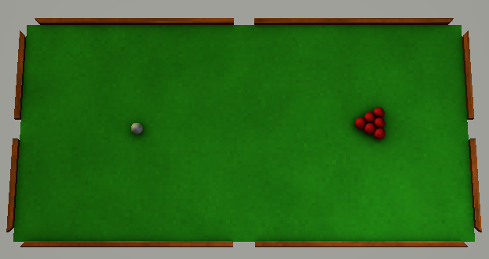
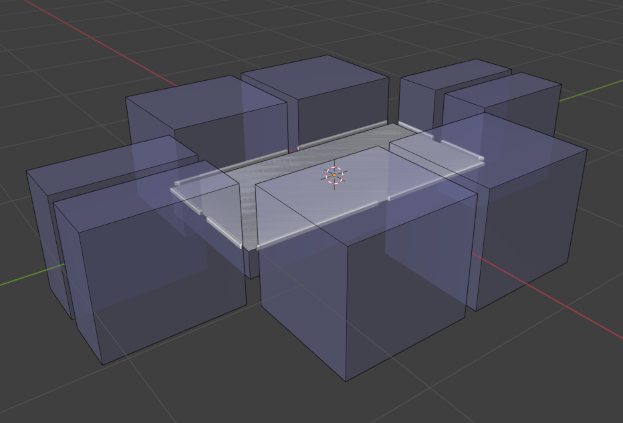
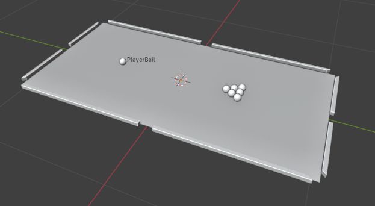

# Yet Another GameDev Framework



## Description

This project is a game development framework with rudimentary physics, graphics and asset management systems.

Its features include, but not limited to:
- [gbuffer-based rendering pipeline](lib/graphics/objects/scene.cpp),
- [flexible asset system](lib/managers/asset_manager.h) with the ability to write [custom importers](lib/graphics/importers/materials.cpp),
- [robust physics engine](lib/physics/level_geometry.h),
- [hierarchical scene organization system](lib/logics/scene.h),
- [simple Blender addon for framework scene format capability](blender),
- [asset-based user input system](lib/input) (soon to be enhanced with an event-driven interface).

WIP (Work In Progress) features:
- [high-level scripting language for sequence programming](https://github.com/Sigmarik/graphics-engine/tree/assets/scene-scripts/lib/logics/blueprints/scripts),
- [support for animated models](https://github.com/Sigmarik/graphics-engine/issues/4),
- [adequate project structure :)](https://github.com/Sigmarik/graphics-engine/issues/26).

## Documentation

As for now, there is none.

Examine template projects, read the interface documentation generated by the `$ make doxy` command (make sure you have doxygen installed), look at the [pull requests](https://github.com/Sigmarik/graphics-engine/pulls?q=is%3Apr+is%3Aclosed) of features you want to learn about.

## Building the project

The project was tested on *Linux Mint 21.2* OS, but should work on other common linux distributions as well.

### GNU Make

1. Install GNU Make version 4.3 or above,
2. Install assimp version 5.2 or above,
3. Install the GLFW library (manually or by running `$ make install-glfw`),
4. Run `$ make`.

After the build is complete, the executable with all corresponding assets can be found in the [build](build/) folder. It can be ran either manually or by executing `$ make run`.

## Screenshots and snippets



*Fig. 1. A preview of the table asset in Blender, ready to be either directly imported into the program, or used in a bigger scene. Blue boxes represent exportable colliders.*



*Fig. 2. A preview of the entire pool table.*

```XML
<material>
    <shader path="assets/shaders/basic.shader.xml"></shader>

    <texture uniform="albedo" path="assets/textures/green_field.png"></texture>
    <texture uniform="ao_map" path="assets/textures/field_ao.texture.xml"></texture>
</material>
```

*Snippet 1. Example of a material asset in the XML format. This particular material can be found [here](assets/materials/field.material.xml).*
