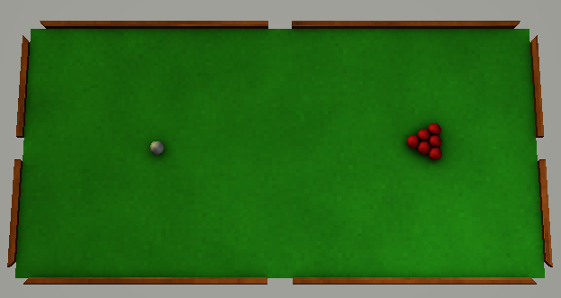

# Mini-billiard

## Description

This is a computer version of the game "billiard", made to test capabilities of the framework it is built upon.

The game consists of a 7 by 3.5-inch table with 7 balls on top of it. One of the balls is controlled by the player and can be tossed around at the start of each turn.

The goal of the player is to push each red ball into one of the 6 holes, while not letting the white ball into the hole. In case the white ball falls into the hole, the game resets.

## Controls

Default key bindings:

- Aim the ball - [Left Mouse Button], [Right Mouse Button]
- Reset the game - [Space]

All controls can be redefined in the corresponding `.keybind.xml` files in the [assets/controls](assets/controls/) directory.

## Customization

All [models](assets/models/), [materials](assets/materials/), [shaders](assets/shaders/), [textures](assets/textures/) and [controls](assets/controls/) can be changed by modifying the project's [assets](assets/). 

There is no guide to creating asset files yet, but exemplary assets should be enough to understand the basics of the system.

## Building the project

The project was tested on *Linux Mint 21.2* OS, but should work on other common linux distributions.

### GNU Make

1. Install GNU Make version 4.3 or above,
2. Install the GLFW library (manually or by running `$ make install-glfw`),
3. Run `$ make`.

After the build is complete, the executable with all corresponding assets could be found in the [build](build/) folder. It can be ran either manually or by executing `$ make run`.
