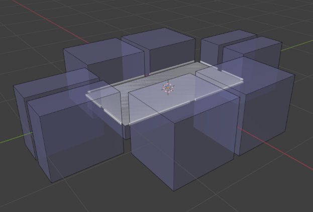
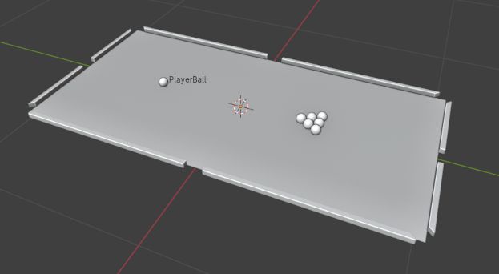

# Yet Another GameDev Framework


## Description

This project is a robust game development framework built with modularity and modifiability in mind.

Its features include, but not limited to:

- [Deferred rendering system](./docs/graphics/CORE.md),
- [Flexible multi-type asset system](./docs/asset_system/CORE.md) with a [custom asset type](./docs/asset_system/CUSTOM_IMPORTERS.md) definition capability,
- [Robust physics engine](./docs/physics/CORE.md),
- [Hierarchical scene organization system](./docs/logics/CORE.md),
- [Robust Blender addon for level creation](./docs/logics/BLENDER_ADDON.md),
- [Asset-based user input system](./docs/input/CORE.md) (soon to be enhanced with an event-driven interface).
- [High-level scripting language for sequence programming](docs/asset_system/EVENT_ROUTING.md),

Work-in-progress features:

- [Support for animated models](https://github.com/Sigmarik/graphics-engine/issues/4),
- [Adequate project structure :)](https://github.com/Sigmarik/graphics-engine/issues/26).

## [Documentation](./docs/structure/MAKE_A_GAME.md)

An overview of the project's systems with links to relevant pieces of documentation can be found [here](./docs/structure/MAKE_A_GAME.md).

Detailed code documentation of the project's systems can be generated with the `$ make doxy` command (make sure you have doxygen installed). Examining the code of the template project can also help.

Many features were documented in the corresponding [pull requests](https://github.com/Sigmarik/graphics-engine/pulls?q=is%3Apr+is%3Aclosed), so it is a good idea to look at one of these if you want to learn more about certain features of the project.

## I am a recruiter. What should I see?

Here is a list of the most interesting parts of the project:

- [The asset system](./docs/asset_system/CORE.md) ([code](./lib/managers/asset_manager.h)). It streamlines the process of asset loading and provides tools for defining custom asset formats.

```XML
<material>
    <shader path="assets/shaders/colored_albedo.shader.xml"/>

    <texture var="albedo" path="assets/textures/noisy.png"/>
    <vec3 var="color" r="1.0" g="0.5" b="0.1"/>
</material>
```

- [A high-level interpreted functional programming language](./docs/logics/EVENT_ROUTING.md) ([head class](./lib/logics/blueprints/scripts/script.h), [lexeme list](./lib/logics/blueprints/scripts/parser/lexemes/operators.h), [AST node example](./lib/logics/blueprints/scripts/nodes/component_io.h)) - a custom event-driven language for game event routing between level components (stuff like lever-to-door connections... but in a game about complex door opening logics).

```Python
@Door::state <- @Lever.pushed and (@Thermometer.temperature > 15.7 or [@Button.pusher.name] == "Garry")
```

A list of curious code examples:

- [`Match<>::To<>::From<>(ptr)`](./lib/memory/match_to.hpp) - a class-to-class map,

```C++
auto constructor = Match<lexemes::Or, lexemes::And>::
                   To<Script::Node, nodes::LogicalOr, nodes::LogicalAnd>::
                   From<NodePtr, NodePtr>::constructor(ptr);

if (!constructor) return;

Script::Node* node = constructor->operator()(alpha, beta);
```

- [`SceneComponent`](./lib/logics/scene_component.h) - the root class for all components, which handles abstract event interfaces, component hierarchy and scene registration and synchronization,
- [`TickManager`](./lib/managers/tick_manager.h) - an overcomplicated solution to refresh rate management and frame-independent physics,
- [`WindowManager`](./lib/managers/window_manager.h) - a comprehensive singleton encapsulation of all window management logics (author: [Nerfiti](https://github.com/Nerfiti)).

## Requirements

The project was tested on *Linux Mint 21.2* OS, yet it should be able to work on any other common linux distribution.

### GNU Make

1. Install GNU Make version 4.3 or above,
2. Install assimp version 5.2 or above,
3. Install the GLFW library (manually or by running `$ make install-glfw`),
4. Run `$ make`.

After the build is complete, the executable and all the assets should be located in the [build](build/) folder. The program can be ran either manually or with the `$ make run` command.

## Screenshots and snippets



*Preview of the table asset in Blender, ready to be either directly imported into the program, or used in a bigger scene. Blue boxes represent exportable colliders.*



*Preview of the entire pool table.*

```XML
<material>
    <shader path="assets/shaders/basic.shader.xml"></shader>

    <texture uniform="albedo" path="assets/textures/green_field.png"></texture>
    <texture uniform="ao_map" path="assets/textures/field_ao.texture.xml"></texture>
</material>
```

*Example of a material asset in the XML format. This particular material can be found [here](assets/materials/field.material.xml).*

```python
message = "Hello from the scripting world! See the level script to learn where this message came from!"

@SomeShouterComponent::shout <- message
@SomeShouterComponent::shout <- [@PlayerBall.knocked_down] ? "RESET!" : IMPOSSIBLE
```

*Example of a high-level event routing script, written in a custom programming language. This particular script can be found [here](assets/levels/pool_table.level.xml).*
