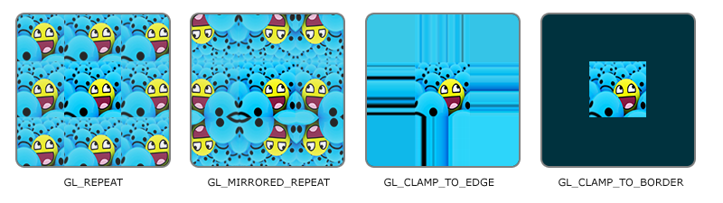

# Custom materials

This guide to writing custom materials is a part of the [graphics system documentation](./CORE.md).

## What is a material

On the structure level, material is a shader with a list of uniform values.

Shader is a program that defines how exactly the material functions.

Uniforms are the parameters transmitted to the shader from the CPU.

## Material descriptors

Material descriptor is an XML file which defines the material.

```XML
<!-- some_material.material.xml -->

<material>
    <shader path="path/to/the/shader/descriptor.shader.xml"/>
    
    <!-- . . . uniforms . . . -->
</material>
```
*An example of a material descriptor.*

The `<shader>` parameter defines a path to the shader descriptor of the material.

All other parameters specify different uniforms of the material.

## Uniform types

### Integer

Integer uniforms represent a single integer "variable" on the GPU.

Uniforms of this type can be defined in a way similar to this:

```XML
<int uniform="uniform_name" value="69"/>
```
*Uniform value specification in a material descriptor.*

```GLSL
uniform int uniform_name = /* default value = */ 420;
```
*An example of an integer uniform in a shader.*

### Float

Floating point uniforms represent a single floating point number "variable" on the GPU.

```XML
<float uniform="uniform_name" value="69.0"/>
```

```glsl
uniform float uniform_name = /* default value = */ 420.0;
```

### Vec2/3/4

2, 3 and 4-dimensional vector uniforms represent a geometrical vector in a space with said number of dimensions.

```XML
<vec2 uniform="uniform_name" x="1.0" y="2.0"/>
<vec3 uniform="uniform_name" x="1.0" y="2.0" z="3.0"/>
<vec4 uniform="uniform_name" x="1.0" y="2.0" z="3.0" w="4.0"/>

<!-- RGBA is a direct equivalent to XYZW -->
<vec4 uniform="color" r="1.0" g="2.0" b="3.0" a="4.0"/>
```

```GLSL
uniform vec2 uniform_name = vec2(1.0, 2.0);
uniform vec3 uniform_name;
uniform vec4 uniform_name;
```

### Mat2/3/4

$N$-dimensional matrix uniforms.

```XML
<mat4 uniform="transform">
    <dx x="1.0" y="0.0" z="0.0" w="0.0"/>
    <dy x="0.0" y="1.0" z="0.0" w="0.0"/>
    <dz x="0.0" y="0.0" z="1.0" w="0.0"/>
    <dw x="0.0" y="0.0" z="0.0" w="1.0"/>
</mat4>
```

The matrix is defined in a transposed view. IN this case, the vector defined in the first line (`<dx . . ./>`) represents the first column of the matrix.

Lower dimension matrices are defined in a similar way.

```GLSL
uniform mat2 matrix = mat2(vec2(1.0, 0.0), vec2(0.0, 1.0));
uniform mat3 matrix;
uniform mat4 matrix;
```

### Texture

Texture uniforms.

Under the hood, texture uniforms are the same as integers with a unique interpretation on both sides. Texture uniform's raw value represents a slot to which the buffer containing the texture is attached. Unfortunately, the number of the slots is limited, so is the number of textures that can be used in a material simultaneously. Currently the limit is 6, as the 7-th and the further slots are reserver for BGuffers.

```XML
<texture uniform="uniform1" file="path/to/the/image.png"/>
<texture uniform="uniform2" path="path/to/the/texture/descriptor.texture.xml"/>
```

Texture uniforms can refer either to a source image, or to a texture descriptor.

```GLSL
uniform sampler2D some_texture = 0;
// 0-th texture channel is often given to the albedo texture, but it is not always the case.
```

#### Texture descriptors

Textures also have a number of parameters that define their behavior.

```XML
<texture>
    <file path="assets/textures/ball_ao.png"/>
    <interp mode="linear"/>
    <wrap mode="clamp_to_border" r="1.0" g="1.0" b="1.0"/>
</texture>
```

The `<file>` parameter defines the path to the source image.

The `<interp>` parameter defines the interpolation mode of the texture (how the texture interpolates values between pixels).
There are two possible options for the `mode` attribute: `linear` and `nearest`.

The `<wrap>` parameter defines the texture wrapping mode. It defines how color values outside of the texture will be calculated.
There are three options for this parameter: `repeat`, `mirrored_repeat`, `clamp_to_edge` and `clamp_to_border`. The last parameter also requires specification of a color which will be used for dots outside of the texture.



*The difference between wrapping modes is show on this excellent demonstration from [LearnOpenGL](https://learnopengl.com/Getting-started/Textures) (original image by Hólger Rezende).*

## Shaders

*This part of the guide requires GLSL knowledge.*

Each shader program in the framework consists of two parts: vertex and fragment shader.

```xml
<shader>
    <fsh path="path/to/the/fragment/shader.fsh"/>
    <vsh path="path/to/the/vertex/shader.vsh"/>
</shader>
```

### Vertex shader

[OpenGL documentation.](https://www.khronos.org/opengl/wiki/Vertex_Shader)

The vertex shader processes raw vertices of the model.

At this stage transform matrices are applied, waving/disposition effects considered and world space vertices projected on to the screen.

```GLSL
#version 330 core

// Vertex info
layout (location = 0) in vec3 i_position;
layout (location = 1) in vec3 i_normal;
layout (location = 2) in vec2 i_uv;
layout (location = 3) in vec3 i_tangent;

// Whatever uniforms the material might need + the uniforms the renderable object provides
// obj_tform and projection matrices are provided to every static mesh material
uniform mat4 obj_tform;
uniform mat4 projection;

// Whatever outputs the fragment shader might need
out vec3 local_pos;
out vec3 world_pos;
out vec4 normal_depth;
out vec2 uv;
out vec3 tangent;
out vec2 screen_pos;

// Implicitly inserted mandatory vertex shader output
// out vec4 gl_Position

void main() {
    // Output vertex screen space coordinates to gl_Position
    // and fill out other VSH outputs/FSH inputs

    gl_Position = projection * obj_tform * vec4(i_position, 1.0);

    // . . .
}
```

### Fragment shader

[OpenGL documentation.](https://www.khronos.org/opengl/wiki/Fragment_Shader)

The fragment shader processes individual pixels of the shape being rendered.

```GLSL
#version 330 core

// Material uniforms
uniform sampler2D albedo;
uniform sampler2D ao_map;

// GBuffer inputs (GBuffers as they were at the end of the previous stage)
uniform sampler2D GB_COLOR;
uniform sampler2D GB_NORM_DEPTH;
uniform sampler2D GB_SURFACE;
uniform sampler2D GB_FINAL;

// VSH outputs/FSH inputs
in vec3 local_pos;
in vec3 world_pos;
in vec4 normal_depth;
in vec2 uv;
in vec3 tangent;
in vec2 screen_pos;

// Mandatory GBuffer outputs
layout(location = 0) out vec4 AlbedoOutput;
layout(location = 1) out vec4 NormalDepthOutput;
layout(location = 2) out vec4 SurfaceOutput;
layout(location = 3) out vec4 FinalColor;

void main() {
    // Modify the values of the GBuffers if needed, copy them otherwise.
    AlbedoOutput = vec4(1.0);
    NormalDepthOutput = texture(GB_NORM_DEPTH,  screen_pos);
    SurfaceOutput =     texture(GB_SURFACE,     screen_pos);
    FinalColor =        texture(GB_FINAL,       screen_pos);
}
```
