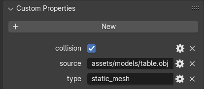
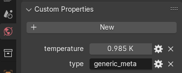
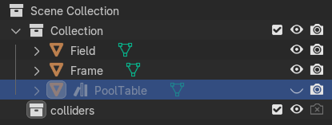

# Logics system

The logics system orchestrates the work of other systems of the framework.

It also provides abstractions for high-level game programming.

## [Scene](./../../lib/logics/scene.h)

Scene is a collection of scene representations from other systems and a set of components populating them.

Scenes often represent a single game level or a screen.

## [Components](./../../lib/logics/scene_component.h)

Components are the game objects like pieces of the environment, triggers, particle emitters e.t.c.

The main purpose of a logics system component is to synchronize the work of component representations in other systems and define its high-level logics.

```C++
#include "logics/scene_component.h"

struct MyComponent : public SceneComponent {
    void phys_tick(double delta_time) override;
    void draw_tick(double delta_time, double subtick_time) override;

    //  . . .

   private:
    Visual<ComplexModel> visual_representation_;
    BouncyObject physical_representation_;
};
```
*An example of a component.*

### Component life cycle

Components go through four major lifecycle events:

#### Construction

During the construction, components define their class members and prepare to be bound to a scene.

This event is signified by the component construction call.

```C++
MyComponent::MyComponent(/* . . . */) : member1_(/* . . . */), member2_(/* . . . */), member3_(/* . . . */) {}
```

#### Registration

When a component is assigned to a scene it gets registered.

At this stage it can register its representations to other system's scenes and perform actions that are expected from the component on when it appears on a scene.

This event is signified by the `begin_play` method call.

```C++
void MyComponent::begin_play(Scene& scene) {
    // Notify the parent class of the registration
    SceneComponent::begin_play(scene);

    get_scene().get_renderer().register(visual_representation_);

    //  . . .
}
```

#### Death

After the component is deleted from the scene it still has an opportunity to do something gameplay-wise before its final destruction.

Deletion of the component is signified by the `end_play` method call.

```C++
void MyComponent::end_play(EndPlayReason reason) {
    // Notify the parent class of the death of the component
    SceneComponent::end_play(reason);

    // Other options include:
    //  EndPlayReason::Crashed
    //  EndPlayReason::Quit
    if (reason != EndPlayReason::Destroyed) return;

    // Optional game events that should happen on component death
    explode();
}
```

#### Destruction

Destruction is signified by the call of the component's destructor.

```C++
MyComponent::~MyComponent() {
    //  . . .
}
```

### Updates

When component is alive and is on a scene, it can receive updates.

There are two types of updates: physical and visual.


In order for the component to actually receive updates it should subscribe to them during registration.

```C++
void MyComponent::begin_play(Scene& scene) {
    SceneComponent::begin_play(scene);

    // Subscribe the component to physics updates
    receive_phys_ticks();

    // Subscribe the component to graphics updates
    receive_draw_ticks();
}
```

Physical updates happen every physics tick. Visual updates happen every visual tick, which is usually more often then physics updates, hence the extra parameter.

```C++
void MyComponent::phys_tick(double delta_time) {
    // Component physics update
    physical_representation_.tick(get_scene().get_collision(), delta_time);

    // Game logics
    if (should_jump()) {
        physical_representation_.set_velocity(physical_representation_.get_velocity() + glm::vec3(0.0, 1.0, 0.0));
    }
}

void MyComponent::draw_tick(double delta_time, double subtick_time) {
    // Extrapolate object's trajectory to the current moment
    glm::vec3 position = physical_representation_.get_interp_pos(subtick_time);

    // Compute the transformation matrix
    glm::mat4 transform = glm::mat4(1.0, 0.0, 0.0, 0.0,
                                    0.0, 1.0, 0.0, 0.0,
                                    0.0, 0.0, 1.0, 0.0,
                                    position.x, position.y, position.z, 1.0);

    // Update visual representation's position parameter
    visual_representation_->set_transform(transform);

    // Do other updates to the visual representation of the component
    //  . . .
}
```

### Subcomponents

Components can have their own children components, which are called subcomponents.

Each subcomponent member should be encased in a special wrapper - `Subcomponent<T>`.

Subcomponents should be initialized during the construction through a call of the `new_child<T>` method.

```C++
struct OtherComponent : public SceneComponent {
    //  . . .
};

struct MyComponent : public SceneComponent {
    MyComponent()
        : child_(new_child<OtherComponent>(/* OtherComponent construction args */)) {}

    private:
    Subcomponent<OtherComponent> child_;
};
```

Registration, death and update events will be implicitly transmitted to subcomponents. No need to explicitly notify them.

### Component events

Components can communicate with each other either by traditional methods, or using the [event system](./../../lib/pipelining/event.hpp).

```C++
#include "pipelining/event.hpp"

Event<std::string> hello_world_event;

Event<std::string>::Listener hw_listener([](std::string message){std::cout << message << std::endl;});
hw_listener.subscribe_to(hello_world_event);

hello_world_event.trigger("Hello, world!");

// Standard output:
//
//  Hello, world!
//
```

All components have public deletion and protected registration events.

```C++
Event<SceneComponent::EndPlayReason>::Listener listener;
Subcomponent<MyComponent> component;

listener.subscribe_to(component->get_destroyed_event());
```

### Abstract component events

Some of the more technical components (like triggers and objects that require activation or any other interaction with the outside world) may have a set of abstract events.

```C++
//Subcomponent::OutputChannel a.k.a. Event<const std::string&>
Subcomponent::OutputChannel* triggered_event = button_component->get_output("pushed");

//Subcomponent::InputChannel a.k.a. Event<const std::string&>::Multilistener
Subcomponent::InputChannel* reset_listener = button_component->get_input("reset");
reset_listener->subscribe_to(some_other_event);
```

#### Adding abstract events to a component

Component's input and output channels should all be members of the component.

Such channels require registration in the component's constructor.

```C++
struct MyComponent : public SceneComponent {
    MyComponent() {
        explode_input_ = InputChannel([](const std::string&){
            explode();
        });

        register_output("exploded", exploded_event_);
        register_input("explode", explode_input_);
    }

    void explode() {
        exploded_event_.trigger("1");

        //  . . .
    }

   private:
    OutputChannel exploded_event_{};
    InputChannel explode_input_{};
};
```

## Level descriptors

Individual game levels can either be created in-game (as is the case with procedural generation), or defined in level descriptors.

Level descriptors are complex assets which store information about sets of scene components.

```XML
<level>
    <static_mesh name="PoolTable">
        <transform>
            <dx  x="1.000000" z="0.000000" y="0.000000" w="0.000000"/>
            <dz  x="0.000000" z="1.000000" y="0.000000" w="0.000000"/>
            <dy  x="0.000000" z="0.000000" y="1.000000" w="0.000000"/>
            <dw  x="0.000000" z="0.000000" y="0.000000" w="1.000000"/>
        </transform>

        <source value="assets/models/table.obj"/>
        <collision value="True"/>
    </static_mesh>

    <ball name="PlayerBall">
        <transform>
            <dx  x="1.000000" z="0.000000" y="0.000000" w="0.000000"/>
            <dz  x="0.000000" z="1.000000" y="0.000000" w="0.000000"/>
            <dy  x="0.000000" z="-0.000000" y="1.000000" w="0.000000"/>
            <dw  x="0.000000" z="0.500000" y="0.028003" w="1.000000"/>
        </transform>

        <player value="True"/>
    </ball>
</level>
```
*An example of a level descriptor.*

```C++
#include "logics/blueprints/external_level.cpp"
#include "managers/asset_manager.h"

const ExternalLevel* level = AssetManager::
        request<ExternalLevel>("path/to/my_level.level.xml");

// SubcomponentNameMap = std::map<std::string, Subcomponent<SceneComponent>>
SubcomponentNameMap imported_components = level->build(scene, glm::mat4(1.0));

imported_components["PlayerBall"]->push(glm::vec3(0.0, 1.0, 0.0));
```
*A level loading example.*

### Component descriptors

Level descriptors contain two types of attributes: component descriptors and scripts.

Component descriptors are attributes with any name other than `<script>`. Argument name defines the type of the component, and the `name` attribute specifies the name which will be assigned to a component in the resulting `SubcomponentNameMap`.

#### Custom component descriptor importers

Component descriptor importer is a regular XML importer which returns a component `Producer`.

```C++
#include "my_component.h"

#include "logics/blueprints/component_importer.h"
#include "logics/blueprints/external_level.h"
#include "xml/data_extractors.h"

// `XML_BASED_IMPORTER`-s can also be used.
XML_IMPORTER(Producer, "my_component") {
    // Read mandatory parameters from the data block
    glm::mat4 transform = demand<glm::mat4>(data, "transform", glm::mat4(1.0));
    glm::vec3 color = demand<glm::vec3>(data, "color", glm::vec3(0.0));

    // Read optional parameters from the data block
    bool likes_ice_cream = request<bool>(data, "likes_ice_cream", true);

    // Form a producer responsible for forming an object on a scene
    return new Asset<Producer>([=](const glm::mat4& root) {
        return Subcomponent<MyComponent>(transform * root, color, likes_ice_cream);
    });
}
```

```XML
<my_component name="MyComponent">
    <transform>
        <dx  x="1.000000" z="0.000000" y="0.000000" w="0.000000"/>
        <dz  x="0.000000" z="1.000000" y="0.000000" w="0.000000"/>
        <dy  x="0.000000" z="0.000000" y="1.000000" w="0.000000"/>
        <dw  x="0.000000" z="0.000000" y="0.000000" w="1.000000"/>
    </transform>

    <color r="1.0" g="0.0" b="1.0"/>
    <likes_ice_cream value="True"/>
</my_component>

```

### Metadata

Level descriptors can also contain metadata, which can be accessed before level being built on a scene.

```XML
<level>

    <!-- . . . -->

    <width_meta type="meta">
        <!-- . . . -->
    </width_meta>

    <!-- . . . -->

</level>
```

*An example of a level metadata block. The `type="meta"` part marks the meta block, `width_meta` defines its internal type (similar to component descriptor types).*

To access level metadata, create an appropriate structure publicly inherited from the `ExternalLevel::Metadata` class and define its importer disguised as an `ExternalLevel::Metadata` importer.

```C++
#include "logics/blueprints/external_level.h"

struct WidthMeta : public ExternalLevel::Metadata {
    double width = 0.0;
};
```

```C++
XML_IMPORTER(ExternalLevel::Metadata, "width_meta") {
    return new Asset<WidthMeta>(/* . . . */);
}
```

```C++
double width = 0.0;

const WidthMeta* meta = level.meta<WidthMeta>();

if (meta) width = meta->width;

if (width > 10.0) {
    level.build(scene, glm::mat4(1.0));
}
```

There can only be one meta block per level. In case many blocks are present, only the last one is picked, with all the previous blocks being silently ignored.

If the level does not contain even a single meta block, its `has_meta()` function will return `false`.

```C++
if (!level.has_meta()) {
    // Absent meta block
} else if (!level.meta<SomeMetaFormat>()) {
    // Incorrect meta block format
} else {
    //  . . .
}
```

#### [Generic metadata](./../../lib/logics/blueprints/generic_meta.h)

There is a default metadata class available, though it is not recommended to use it for anything except debugging.

```XML
<generic_meta type="meta" something="anything">
    <!-- Literally anything -->
</generic_meta>
```
*`<generic_meta ...>` contents are not bound by any format.*

```C++
#include "logics/blueprints/generic_meta.h"

const GenericMeta* meta = level.meta<GenericMeta>();

if (meta) {
    tinyxml2::XMLElement data = meta->xml();

    //  . . .
}
```
*The `GenericMeta` class acts as an XML mirror, storing a copy of the `<generic_meta ...>` element in itself.*

### Scripts

High-level event management can be implemented on a scene with [event routing scripts](./EVENT_ROUTING.md).

```XML
<level>
    <!-- . . . -->

    <script file="path/to/the/script.script"/>

    <!-- . . . -->
</level>
```

```python
# script.script

@PlayerBall::reset <- @PlayerBall.knocked_out or @GameManager.reset
```

### Reusable levels

`ExternalLevel` instances can be reused for putting multiple copies of the level on a same scene or reloading the level on a different scene.

This feature is most useful if only part of the level is encoded in a descriptor.

```C++
void on_transition_triggered() {
    static const ExternalLevel* next_section = AssetManager::request<ExternalLevel>("part_3.level.xml");

    next_section->build(previously_used_scene, section_root_location);
}

void load_tile(unsigned id_x, unsigned id_y) {
    const ExternalLevel* tile = tiles[id_x][id_y];

    tile->build(open_world, translation_matrix(glm::vec3(id_x, 0.0, id_y) * TileSize));
}

void wave_function_collapse() {
    //  . . .

    const ExternalLevel* tile = tiles[rand() % tile_count];
    
    if (compatible) tile.build(scene, cell_origin);

    //  . . .
}
```

### Level editing in [Blender](https://www.blender.org)

Level descriptors can either be created manually, or made in [Blender](https://www.blender.org) and exported using the [addon](./../../blender/level_exporter.py).

The addon allows to export blender scenes as framework-compatible level descriptors.

Any object having a `type` custom property will be added to the level descriptor, with all the other custom properties being a part of the descriptor.



World properties will be exported as metadata if the `type` field is specified.



#### Implicit properties

As well as exporting all custom properties, the addon adds a few of its own to every exportable object.

- `transform` - transform matrix of the object,
- `blender_type` - type of the object in Blender format (e.g. MESH, CURVE, LIGHT),
- (only for lights) `color` - light color multiplied by intensity,
- (attribute) `name` - object's name.

Addition of an ambient light component with the same color as the world color is also possible and can be enabled on the export options screen.

#### Recognizable objects

By default the framework includes importers for some types of common objects.

##### [`static_mesh`](./../../lib/logics/components/visual/static_mesh_importer.cpp)

Used for [static mesh components](./../../lib/logics/components/visual/static_mesh.h).

Mandatory properties:

- `transform` (Matrix 4) - component transform,
- `source` (String) - path the source file of the model.

Optional properties:

- `collision` (Bool) (default: `False`) - should the static collision be imported with the model, in case the source of the model contains a `_box_`-defined collision.

##### [`point_light`](./../../lib/logics/components/visual/point_light_importer.cpp)

Used for [point light components](./../../lib/logics/components/visual/point_light_cmp.h).

Mandatory properties:

- `transform` (Matrix 4) - component transform,
- `color` (Color) - light color and intensity.

Optional properties:

- `spread` (Float) (default: `3.0`) - light spread,
- `radius` (Float) (default: `0.0`) - radius of the light source.

##### [`ambient_light`](./../../lib/logics/components/visual/ambient_light_importer.cpp)

Used for [ambient light components](./../../lib/logics/components/visual/ambient_light_cmp.h).

Mandatory properties:

- `color` (Color) - light color and intensity.

##### [`box_collider`](./../../lib/logics/components/physical/box_collider_importer.cpp)

Used for [static box colliders](./../../lib/logics/components/physical/static_box_collider.h).

Mandatory properties:

- `transform` (Matrix 4) - 1x1x1 meter box transform.

##### [`shouter`](./../../lib/logics/components/logical/shouter_importer.cpp)

Used for [shouter components](./../../lib/logics/components/logical/shouter.h).

#### Blender assets

As of the version 3.0, Blender has its own [asset system](https://docs.blender.org/manual/en/latest/editors/asset_browser.html), which can be used in combination with the addon for convenience.

##### Asset libraries

It is often convenient to organize different assets used in the game into asset libraries that can be included into the level project and used there.

Individual assets, like elements of the level such as static meshes, can be organized into assets inside their own source files.

Static meshes source file can have an asset build into it by having a fictitious invisible object with the properties of the static mesh descriptor that has been turned into a blender asset. Moreover, such an object can either inherit the geometry of the source object, or have a geometry of its own with pieces only useful when editing a level.



##### Built-in asset library

The library of built-in component assets is still in the testing.

Though there is an [addon](./../../blender/model_transformer.py) available that helps transform blender objects into static mesh descriptors.
