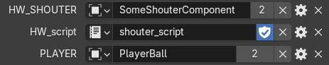

# Event routing scripts

## Motivation and the general idea

Some high-level components of a game scene may have their own input and output events, such as a door having an event listener that controls its open/closed states or a button having an event broadcasting its most recent updates, such as it being pushed or released.

But to be useful these events and listeners need to be linked to each other. Establishing these networks of components can become very tedious, especially as they often need to be set up on top of asset-defined levels. 

High-level event routing scripts aim to solve that problem by moving event routing from low-level component logics to high-level scripts which can be included into level descriptors.

For example, the logics of a door opening when both buttons are pressed would have been very hard to implement with a good level of abstraction, accounting for every type of door behavior a game might need.

```C++
void DoorOnLevel14::update(double delta_time) {
    // Actual door logics

    state_ = button16.state && lever5.state;
}

void DoorOnLevel16::update(double delta_time) {
    // Actual door logics

    state_ = lever7.state && (boss.is_killed || player.has_artifact);
}

// . . .
```
*An example of a failed attempt to define high-level door opening logics inside of a low-level game component such as a door.*

```XML
<level>
    <door name="ImportantDoor">
        ...
    </door>

    <button name="DoorOpener1">
        ...
    </button>

    <button name="DoorOpener2">
        ...
    </button>

    <script content='
        # Opens the door when both buttons are pushed
        @ImportantDoor::open <- @DoorOpener.state and @DoorOpener2.state
    '/>
</level>
```
*The same high-level logics, but now defined appropriately with the high-level event routing system. Low-level `DoorComponent` now only needs to define its basic functionality and not to worry about its potential use cases.*

## The general structure

A typical script consists of a set of pipes - links between component's input and output channels.

```python
# An example of a pipe
@Object::input_channel <- @OtherObject.output_channel
```
*An example of a pipe which transmits events from the channel named "output_channel" of the "OtherObject" scene component (a component with the name "OtherComponent" on the scene) to the input named "input_channel" of the "Object" component.*

Channel outputs may be modified and combined between each other with operators.

```python
@ImportantDoor::open <- @DoorOpener.state and @DoorOpener2.state
```
*In this example the door will receive updates on the "open" channel whenever either of the openers sends an update of the "state" channel. Operator "and" is used here only for payload modification? which will be described in the following paragraphs.*

## Event payload modification

Each component event carries a payload - a string, which the component may interpret however it wants.

Event payload gets transmitted through pipes and can be modified with operators.

```python
@Shouter::shout <- @Player.name
```
*If the "Player" component sends an event with some payload through the "name" channel, the shouter will receive the same payload to its "shout" channel and, consequently, print it to the console.*

```python
@Boss::damage <- @Player.hit_strength + @Environment.danger
```
*In this example the player's strength gets added to the environment's danger level, and then sent to the "damage" channel.*

### Data types

Although pipes and operators work assuming every event transmits strings, some operators may interpret strings differently.

There are four major subtypes of data which certain operators require:
- String is the most basic and underlying type of event data managed by pipeline scripts.
- Number is equivalent to the `double` type in C++, and is represented by a numeric string in decimal base (`"-1.23" = -1.23`, `"1.2300" = 1.23` and so on).
- Boolean is a derivative type of the length of a string. Any string with the length greater than zero is considered truthful. For example, `"true" = true`, `"false" = true`, `"1" = true`, `"" = false`.
- Component ID is an ID of a component on the scene. It can either be obtained from other component (`@Spawner.last_spawned`) or by mentioning a component by name in a constant (`@SomeComponent`).

*Under the hood, component IDs are just hexadecimal representations of their GUIDs.*

### Constants

Not only events can be present in the right part of the pipes. Any string that is not an operator is considered a constant. A constant acts as an output channel that emits a single value on the script creation (this will be explored in greater detail in the [Update order](#update-order) paragraph).

```python
@Boss::damage <- @Player.strength - 10
```
*In this example the string "10" is a constant. "@Boss", "@Player" and "strength" are constants as well, but we do not need to think about this for now.*

Only alphanumeric characters and `_` can be present in bare, not enclosed in quotation mark string constants. If more complex expressions need to be present, quotation marks (`"..."`) should be used.

The decimal dot `.` can be a part of a string if all the prior characters of it were numeric.

```python
@Shouter::shout <- 715.0123  # <- "715.0123" is a single string
@Shouter::shout <- 7u5.0123  # <- "7u5" and "0123" are two separate string constants separated by a channel reference operator `.`
```

Special characters like line brakes and tabulation can be used directly in strings. Characters like `\` or `"` need a `\` character placed in front of them.

```python
@Shouter::shout <- "This is a very special string. It contains line breaks ->
    <- indentation
and illegal characters like \" and \\"

# Standard output (console):
#
# Shouter: This is a very special string. It contains line breaks ->
#     <- indentation
# and illegal characters like " and \
#
```

Components can be mentioned and transformed into a component ID constant through the use of the `@` prefix before their name.

```python
# Operator `~` is used for string concatenation. The operator has not been implemented yet, and is here purely for demonstrational purposes.
@Shouter::shout <- "Player's GUID is " ~ @Player
@Shouter::shout <- "In contrast, here is the \"Player\" string: " ~ Player

# Standard output (console):
#
# Shouter: Player's GUID is A14EB... (32 random HEX characters)
# Shouter: In contrast, here is the "Player" string: Player
```

## Update order

Operators and pipes themselves only do something when they are updated by their inputs or by themselves. Most operators are binary (meaning they have two inputs and produce a single output, such as the `+` (addition) operator), but there are some that are ternary (three inputs, one output) or unary (1 input, 1 output).

When an operator is updated, it makes sure that every input has been updated at least once before that moment in time, and if they were, it processes their current values and emits an event with the corresponding payload.

Lets take a look at a typical operator such as the `+` in the expression `A + B`, where `A` and `B` are some other operators, events or constants. Lets imagine that `A` gets updated first, and now has a value of `"4.0"`. It notifies the `+` operator that one of its inputs got updated. The `+` operator than looks at both his inputs (`A` and `B`) and determines, that while `A` has a valid value of `"4.0"`, `B` has never been updated yet, and thus has no value. It does not satisfy the `+` operator's requirements, and it does not set its value, that was missing since the initialization. It still emits the event and notifies its parent operator of a change, as it would have even if its value was not changed, but remains without a value. If at this stage `A` was to be updated, the same steps would have been taken. Now imagine that the `+` operator receives an update from `B`, which now got a value of `"6.0"`. Both inputs of the operator now have values, and the operator can now set its value to `"10.0"`, which is dictated by its internal implementation. As was the case earlier, an event gets emitted from the `+` operator to its parent, notifying it of the update that took place.

Constants emit their updates in the order they are mentioned in the script.

```python
@Shouter::shout <- "Hello, " ~ ("beautiful " ~ "world!")

# Update order of the constant nodes:
# 1: @Shouter
# 2: "shout"
# 3: "Hello, "
# 4: "beautiful "
# 5: "world!"
```

Most conventional operators follow this logic. There are only a number of exceptions to this rule, which are described in the [Flow control](#flow-control) paragraph.

## Flow control

While most operators follow the rules described in the [Update order](#update-order) paragraph, the sequence of updates can be changed with special operators.

An operator enclosed in curly brackets (`{}`) will not emit an event if the update did not change its value.

```
 some_expression :  "Hello" -> "Hello" -> "World"
{some_expression}:  "Hello"      ->       "World"
```
*If `some_expression` sent three events, the first two of which had "Hello" for payload, then the expression `{some_expression}` would have emitted an update event only twice, when the payload of the underlying expression (e.g. `some_expression`) changed.*

An operator enclosed in a pair of square brackets (`[]`) will erase its value after each update. Is is useful for tracking the origin of the event in operators with multiple inputs.

For example, a pipe

```python
@Shouter::shout <- [@Player.hit] + @Player.damage_boost
```

will activate only if the event originates from the `"hit"` channel of the player and not from the `"damage_boost"` channel, contrary to the `@Shouter::shout <- @Player.hit + @Player.damage_boost` pipe, which will activate every time either of the events are triggered.

The function `skip_invalid()`  will muffle any event that carries no value (such as "blank" updates of binary nodes).

A pipe itself does not activate if the right part of it is invalid, meaning that pipes `object::channel <- ...` and `object::channel <- skip_invalid(...)` are equivalent to one another.

## `:: <-` and `.` operators

Pipe declaration and channel mention expressions are also operators. But, unlike other operators, they directly communicate with scene components.

The `.` operator requires left argument to be a valid component ID, and the right to be a valid channel name. If either of these criteria are not met, a warning will be printed to the logs. Otherwise on an update of the operator a listener will be created and linked to the corresponding output channel of the component, which will generate outgoing events of the operator.

The pipe operator has the same requirements for its two left parts as the `.` operator.

Before the pipe has an existing value on both of its left inputs, it holds the last event received from the right input. After that any event received from the right input without a valid channel binding to an input channel of a component will be ignored.

## The conditional operator

The conditional operator `? :` only requires the existence of its leftmost value to be updated.

On update it checks the length of the left value, and if it is greater than zero, sets its own value equal to the central input's value. Otherwise it retranslates the rightmost value it receives.

## Variables

Variables are expressions which can be referenced by a string (a variable's name).

Variables can be defined with the `=` symbol.

```python
# The declaration of the variable `boss`
boss = @BossSpawner.last_spawned

# Use of the variable `boss`
@NameShouter::shout <- boss.name
# Equivalent* of the `@NameShouter::shout <- @BossSpawner.last_spawned.name` pipe.
# * - The order of constant initialization is different, as if the variable is defined, "@BossSpawner" and "last_spawned" constants are mentioned (and thus, updated earlier) than the "@NameShouter" and "shout" constants.

# Pure strings (string constants not in quotation marks) are not recognized as variable names
@SomeOtherShouter::shout <- "boss"
```

## List of operators and functions

These are the operators recognized by the script assembler:

- `A :: B <- C` or `A -> B <- C` - a pipe from the expression `C` to the input channel `B` of the component `A`,
- `A.B` - a reference to the channel `B` of the component `A`,
- `A == B` - an equality comparison (interprets inputs as strings),
- `A != B` - an inverted equality comparison (interprets inputs as strings),
- `A || B` or `A or B` - an `or` logic gate (interprets inputs as booleans),
- `A && B` or `A and B` - an `and` logic gate (interprets inputs as booleans),
- `A ? B : C` - the conditional operator (see the [Conditional Operator](#the-conditional-operator) paragraph),
- `A > B`, `A < B`, `A >= B`, `A <= B` - comparison operators (interpret inputs as numbers),
- `A + B`, `A - B`, `A / B`, `A * B` - arithmetic operators (interpret inputs as numbers),
- `sin(X)`, `cos(X)` - trigonometric functions (interpret the input as a number),
- `ln(X)` or `loge(x)`, `log2`, `log10` - logarithmic functions (interpret the input as a number),
- `abs(X)`, `sign(X)` - `abs()` and `sign()` functions (interpret the input as a number),
- `len(X)` - input's length (interprets the input as a string),
- `skip_invalid(X)` - input existence check (see the [Flow Control](#flow-control) paragraph),
- `valid(X)` - determine the validity of the input (returns `""` if `X` does not hav a value, `"1"` otherwise).

## Comments

Lines starting with `//` or `#` are ignored during the script compilation and can be used as comments.

# Using event routing scripts in Blender

Scripts can be included in a scene either by linking a file or by writing it in-place.

```XML
<level>

. . .


<script file="my_script.script"/>

<script content='
@Door::open <- @Button.pushed
'/>

. . .

</level>
```

The [level export plugin for Blender](../../blender/level_exporter.py) has the capacity to include scripts in scene descriptors. To do this, create a custom object parameter of the `Data-block` type and the `Text` subtype, and link the script to it. The parameter's name should contain `"script"` as a case-sensitive substring (`"script_15"` - OK, `"Script15"` - not recognized).

Scripts can also be linked to world's custom parameters.

## Component name emplacement

The plugin will automatically detect strings encased in dollar symbols `$$` ant attempt to replace them with `@`-references to objects referenced in custom parameters of the object.

For example, if a script has a `$TARGET$` string, and the object it is referenced by has a `TARGET` parameter of type `Data-block`, referencing another object, the original string `$TARGET$` will be replaced with a reference to said object.

The `$THIS$` string always gets replaced with a reference to the component the script is referenced by.

This feature is most useful for creating high-level Blender assets with included scripts. What it allows to do is to create an object with an abstract script, and then use the same script on multiple copies of the object.



In this particular case, the world-referenced script

```python
message = "Hello from the scripting world! See the level script to learn where this message came from!"

$HW_SHOUTER$::shout <- message
$HW_SHOUTER$::shout <- [$PLAYER$.knocked_down] ? "RESET!" : IMPOSSIBLE
```

gets transformed into

```python
message = "Hello from the scripting world! See the level script to learn where this message came from!"

@SomeShouterComponent::shout <- message
@SomeShouterComponent::shout <- [@PlayerBall.knocked_down] ? "RESET!" : IMPOSSIBLE
```

on export.
